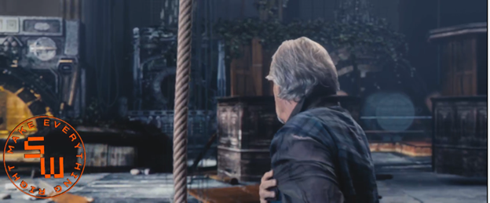
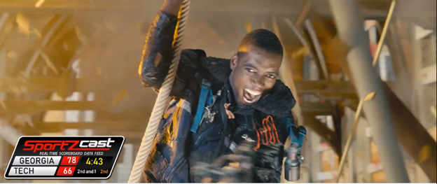
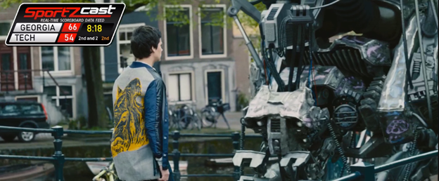

# HTML Motion Graphics Overlay Sample

The scenario for this sample is inspired by a cloud-based live production workflow running in AWS that takes a live video source and applies a composition process to include a motion graphics overlay generated by an HTML source.

## Architecture
The sample demonstrates a practical use of the [AWS Cloud Digital Interface (CDI)](https://aws.amazon.com/media-services/resources/cdi/) where a composition process running in an [AWS EC2](https://aws.amazon.com/ec2/) instance overlays full motion graphics such as an animated logo or a scoreboard onto a live video source streamed from [AWS Elemental MediaConnect](https://aws.amazon.com/mediaconnect/). The motion graphics are generated by rendering an externally provided HTML source.

Using CDI, the result is transmitted as uncompressed video through the network to a second EC2 instance where it is encoded and packaged as HLS segments, uploaded to an [AWS S3](https://aws.amazon.com/s3/) bucket, and then streamed live to clients. As an alternative, the output can be sent directly to [AWS Elemental MediaLive](https://aws.amazon.com/medialive/) which also supports CDI input sources.


A brief description of each component is included below.

### Media Sources
The inputs of the composition process are a live video source and the HTML markup used to render the motion graphics overlay. 

As a video source, the sample uses a MediaConnect flow connected to a third EC2 instance reproducing a sample video file in a loop and streaming the output to MediaConnect using RTP. Of course, it can be replaced by any suitable live video source.

The overlay source can be any HTML content capable of rendering an animation. It is retrieved from an external web server or an S3 bucket using HTTP or read from a local file on disk. 

### Motion Graphics Renderer
The Motion Graphics Renderer is a process that uses an offscreen Chromium instance to render the externally provided HTML source. It captures changes to the rendered page and outputs them as a sequence of uncompressed video frames.

HTML can take many different forms, so several mechanisms are available to customize the way in which the graphics are rendered onto the live video.  

For example, the graphics renderer can change the size of the page, which is useful for adaptive layouts that behave differently depending on window size, or it can limit the capture to a specified region of the page for cases where there are additional elements that should not be included in the overlay. Finally, it can apply a scaling factor to control the overall size of the rendered elements.

Transparency effects can be applied as well. By default, the background is made transparent so that the live video shows behind any elements rendered directly on the page. A specific color can be designated as transparent instead (chroma key) to handle elements placed inside other containers and not directly onto the body. Lastly, the renderer can apply a given background color to the overlay and create opacity effects by changing its alpha component.



### Composer
The composition in this sample is handled by [FFmpeg](https://ffmpeg.org/) running in the first EC2 instance and reading the RTP stream coming from MediaConnect. It decodes the incoming stream and then overlays the sequence of raw frames produced by the Motion Graphics Renderer. 



The overlay position on the screen can easily be changed to accomodate different requirements.



The output from the composer is uncompressed video which then needs to be delivered to the second EC2 instance running the encoder.

### CDI Pipe
CDI must be used to transport the uncompressed video across the network with minimal latency. While most applications will typically add support for CDI natively, in this case we are using an existing application, FFmpeg, and integrating CDI. 

To enable this integration, the transmission is handled by another component that is essentially a protocol bridge between a local inter-process communication mechanism, in this case sockets, and CDI. This component can act as a transmitter, in which case it reads a video stream from a local socket and transmits it to a CDI destination, or it can behave as a receiver, reading a CDI stream and outputting the data it receives to a local socket where applications can connect to process the incoming stream.

The composer, or any socket capable application, can be connected to the CDI pipe to enable them to transmit or receive live video using CDI. 

### Encoder
Video stream encoding is performed by the second EC2 instance. This machine is also running another instance of the CDI Pipe component, this time configured in receiver mode. Once again, FFmpeg is used to connect to the component’s output socket to read the uncompressed video coming from the first machine, encode it, and then package the result as an HLS stream. 

As each HLS segment is encoded, it is uploaded to an S3 bucket that has been previously created and configured with a policy that enables public read access. Currently, this process involves mounting the S3 bucket as a virtual drive in the second EC2 instance using a third-party component (CloudBerry), although this may change in the future. The HLS segments are written directly to this drive as if it were a local disk.

While in this sample the composition output is sent directly to the encoding process running in a separate machine, other production workflows could involve additional intermediary processes where the video is transported for processing between two or more EC2 instances using CDI.

### Clients
Clients can use any HLS capable player to read the manifest from the S3 bucket and play back the composition output.

## Prerequisites
- Microsoft Visual Studio (with the C# and C++ Development workloads installed)
- FFmpeg (http://ffmpeg.org/download.html)
- VLC (optional, http://www.videolan.org/vlc/)

> **NOTE:** This sample currently runs on **Windows ONLY**.

## Setup
- Follow the instructions from the [AWS CDI SDK installation guide](https://github.com/aws/aws-cdi-sdk/blob/mainline/INSTALL_GUIDE_LINUX.md#install-aws-cdi-sdk) to clone the **AWS CDI SDK** and **Libfabric** GitHub repositories.

- Follow the [AWS SDK build steps](https://github.com/aws/aws-cdi-sdk/blob/mainline/INSTALL_GUIDE_WINDOWS.md#download-and-build-the-aws-sdk-for-c) to download and build the **AWS SDK for C++**.
  > **Note:** When runnning the `msbuild` command to build the SDK, make sure to also include the `/p:Configuration` parameter specifying the selected configuration mode (Debug or Release). Example to build in Release mode:
  > ```
  > msbuild ALL_BUILD.vcxproj /p:Configuration=Release
  > ```

- Follow the [AWS CDI SDK build steps](https://github.com/aws/aws-cdi-sdk/blob/mainline/INSTALL_GUIDE_WINDOWS.md#build-the-aws-cdi-sdk) to build the **AWS CDI SDK**.
    > **Note:** Before building the SDK, disable the display of performance metrics to your Amazon CloudWatch account. To do this, edit the `aws-cdi-sdk\src\cdi\configuration.h` file and comment out the following directives:
    > -  `#define CLOUDWATCH_METRICS_ENABLED`
    > - `#define METRICS_GATHERING_SERVICE_ENABLED`

- Set the following environment variables before building the sample:
  - **CDI_SDK_PATH**: path to the root folder of the _AWS CDI SDK_ local repository.
  - **LIBFABRIC_PATH**: path to the root folder of the _Libfabric_ local repository.

- Open and build the _**dev\Video.Tools.sln**_ solution in Visual Studio and build it. Make sure to select the target platform and type of build; by default, all binaries are placed in the _**build**_ directory of the repository inside a folder corresponding to the platform and type of build (e.g. _**build\x64\Release**_).

- Download the sample video from the link below and copy it to the **scripts** folder:
http://ftp.nluug.nl/pub/graphics/blender/demo/movies/ToS/tears_of_steel_720p.mov.

- Set the following environment variables before running the scripts. Alternatively, configure the FFmpeg, VLC, and Video Tools executables in your path.

  - **FFMPEG_PATH**: path to _ffmpeg.exe_, _ffplay.exe_, and _ffprobe.exe_
  - **VLC_PATH**: path to _vlc.exe_
  - **TOOLS_PATH**: path to _htmlsrc.exe_ and _rmtpipe.exe_

## Running the Sample
The _**execute**_ script in the _**scripts**_ folder can be used to invoke the tools for a variety of configurations. Refer to the examples section for more information.


> **Note:** Unless specified otherwise, the examples run both the transmitter and receiver locally using the **socket_libfabric** adapter. For running in AWS between two separate machines, refer to the Krill SDK documentation for setting up the EC2 instances and to the examples section in this document for the command options required to run with transmitter and receiver in separate machines using the **EFA** adapter.

### Usage
  **EXECUTE** _\<source\>_ [_\<options...\>_]  

```
<source>                              : source file or URL (required)
```

### Options

    -role <type>                          : type of role: transmit | receive | both (optional, default: both)
    -mode <option>                        : receiver mode: play | stream | store (optional, default: play)
    -channel <type>                       : type of communication channel: pipe | udp | krill (optional, default: krill)
    -adapter <type>                       : type of adapter: efa | socket | socket_libfabric | memory
                                            (optional, Krill tranport only, default: socket_libfabric)
    -local_ip <ip_address>                : local network adapter IP address (optional, default 127.0.0.1 or IP address
                                            of first local adapter when -remote_ip specified)
    -remote_ip <ip_address>               : remote network adapter IP address (optional, transmit only, default 127.0.0.1
                                            or IP address of first local adapter when -local_ip specified)
    -port <port_number>                   : destination port number (optional, default 2000)
    -output <destination>                 : output file or URL (required for stream and store receiver modes)
    -output_format <type>                 : output format type: rgb | mp4 (optional, default: rgb)
    -receive_pts                          : enable presentation timestamp overlay for receiver (optional)
    -transmit_pts                         : enable presentation timestamp overlay for transmitter (optional)
    -overlay <overlay_source>             : file or URL of the overlay page (optional, default is no overlay)
    -overlay_window_size <width height>   : overlay window width and height (required when overlay specified)
    -overlay_viewport_origin <left top>   : overlay viewport origin left top coordinates (optional, default is 0 0)
    -overlay_viewport_size <width height> : overlay viewport width and height (optional, default is overlay window size)
    -overlay_framerate <rate>             : overlay frame rate (optional)
    -overlay_scale_factor <scale>         : overlay scale factor (optional)
    -overlay_chroma_color <color>         : overlay transparent color (optional)
    -overlay_background_color <color>     : overlay background color (optional)


## Examples
> **Note:** The following command lines assume that the script is being executed from the _**scripts**_ directory where you have also copied the source video downloaded from:  
http://ftp.nluug.nl/pub/graphics/blender/demo/movies/ToS/tears_of_steel_720p.mov.

### Using a Krill channel between transmitter and receiver, with no overlay
```
EXECUTE tears_of_steel_720p.mov
```

### Using a Krill channel between transmitter and receiver, with an overlay
```
EXECUTE tears_of_steel_720p.mov -overlay http://scoreboards.sportzcast.net/Prod/mike_CR/mikedemo.html -overlay_window_size 1100 306 -overlay_frame_rate 1
```

### Using a Krill channel between transmitter and receiver, with an overlay and scaling
```
EXECUTE tears_of_steel_720p.mov -overlay http://scoreboards.sportzcast.net/Prod/mike_CR/mikedemo.html -overlay_window_size 1100 306 -overlay_frame_rate 1 -overlay_scale_factor 0.6
```

### Using a Krill channel between transmitter and receiver, with an overlay, scaling and chroma key
```
EXECUTE tears_of_steel_720p.mov -overlay https://threejs.org/examples/#webgl_morphtargets_horse -overlay_viewport_origin 500 55 -overlay_window_size 1366 768 -overlay_viewport_size 800 600 -overlay_frame_rate 24 -overlay_scale_factor 0.75 -overlay_chroma_color #F0F0F0
```

### Using a Krill channel between transmitter and receiver, with an overlay and transmitter/receiver PTS
```
EXECUTE tears_of_steel_720p.mov -overlay https://threejs.org/examples/#webgl_morphtargets_horse -overlay_viewport_origin 500 55 -overlay_window_size 1366 768 -overlay_viewport_size 800 600 -overlay_frame_rate 24 -overlay_scale_factor 0.75 -overlay_chroma_color #F0F0F0 -transmit_pts -receive_pts
```

### Using a pipe between transmitter and receiver, with an overlay
```
EXECUTE tears_of_steel_720p.mov -overlay http://scoreboards.sportzcast.net/Prod/mike_CR/mikedemo.html -overlay_window_size 1100 306 -overlay_frame_rate 1 -overlay_scale_factor 0.6 -channel pipe
```

### Using an UDP channel transmitter and receiver, with an overlay
```
EXECUTE tears_of_steel_720p.mov -overlay http://scoreboards.sportzcast.net/Prod/mike_CR/mikedemo.html -overlay_window_size 1100 306 -overlay_frame_rate 1 -overlay_scale_factor 0.6 -channel udp
```

### Using a Krill channel between transmitter and receiver, with an overlay, and streaming the output using HTTP
```
EXECUTE tears_of_steel_720p.mov -mode stream -overlay http://scoreboards.sportzcast.net/Prod/mike_CR/mikedemo.html -overlay_window_size 1100 306 -overlay_frame_rate 1 -overlay_scale_factor 0.6 -output "http://127.0.0.1:8080/krill.mpg" -output_format mp4
```

### Running transmitter and receiver on separate machines and connected with an RMT (Krill) channel (and using an EFA adapter)
**For transmitter:**
```
EXECUTE tears_of_steel_720p.mov -local_ip XX.XX.XX.XX -remote_ip YY.YY.YY.YY -adapter efa -role transmitter
```
**For receiver:**
```
EXECUTE tears_of_steel_720p.mov -local_ip XX.XX.XX.XX -adapter efa -role receiver
```

### Using a Krill channel between transmitter and receiver, with an overlay, and storing the encoded output to a file
```
EXECUTE tears_of_steel_720p.mov -mode store -overlay http://scoreboards.sportzcast.net/Prod/mike_CR/mikedemo.html -overlay_window_size 1100 306 -overlay_frame_rate 1 -overlay_scale_factor 0.6 -output krill-encoded.mpg -output_format mp4
```

### Using a Krill channel between transmitter and receiver, with an overlay, and storing the raw uncompressed output to a file
**\*\*\* BEWARE OF FILE SIZES! Press Ctrl+C after a few seconds \*\*\***
```
EXECUTE tears_of_steel_720p.mov -mode store -overlay http://scoreboards.sportzcast.net/Prod/mike_CR/mikedemo.html -overlay_window_size 1100 306 -overlay_frame_rate 1 -overlay_scale_factor 0.6 -output krill-raw.rgb -output_format rgb
```

### Using a background color with opacity
```
EXECUTE tears_of_steel_720p.mov -overlay http://scoreboards.sportzcast.net/Prod/mike_CR/mikedemo.html -overlay_window_size 1100 306 -overlay_frame_rate 1 -overlay_background_color #66FFFFFF -overlay_scale_factor 0.6
```
### Using chroma key and a background color
```
EXECUTE tears_of_steel_720p.mov -overlay http://scoreboards.sportzcast.net/Prod/mike_CR/mikedemo.html -overlay_window_size 1100 306 -overlay_frame_rate 1 -overlay_background_color #66FFFFFF -overlay_scale_factor 0.6 -overlay_chroma_color #7C2F3F
```
### Adjusting the overlay viewport size and origin to clip the page region of the HTML source
```
EXECUTE tears_of_steel_720p.mov -overlay http://scoreboards.sportzcast.net/Prod/mike_CR/mikedemo.html -overlay_frame_rate 1 -overlay_scale_factor 0.8 -overlay_window_size 1100 306 -overlay_viewport_origin 326 76 -overlay_viewport_size 520 160
```

## Known Issues
- Press CTRL+C to exit the transmitter and, depending on running options, also the receiver. Press 'q' to exit the player.
- In streaming mode, the player can only start after the streaming has already started; otherwise, it shuts down. Currently, a timer delays the start for 10 seconds. If the player does not start successfully, you can start it manually and connect to the HTTP stream URL.