# HTML Motion Graphics Overlay Sample

The scenario for this sample is inspired by a cloud-based live production workflow running in AWS where a composition process applies a motion graphics overlay generated by an HTML source to a live video.

## Architecture
The sample demonstrates a practical use of the [AWS Cloud Digital Interface (CDI)](https://aws.amazon.com/media-services/resources/cdi/) where a process running in an [AWS EC2](https://aws.amazon.com/ec2/) instance overlays full motion graphics such as an animated logo or a scoreboard onto a live video source streamed from [AWS Elemental MediaConnect](https://aws.amazon.com/mediaconnect/). The graphics are generated by rendering an externally provided HTML source.

Using CDI, the result is transmitted as uncompressed video through the network to a second EC2 instance where it is encoded and packaged as HLS segments, uploaded to an [AWS S3](https://aws.amazon.com/s3/) bucket, and then streamed live to clients. As an alternative, the output can be sent directly to [AWS Elemental MediaLive](https://aws.amazon.com/medialive/) which also supports CDI input sources.


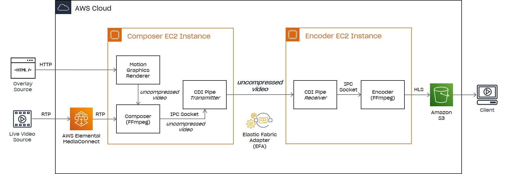


A brief description of each component is included below.

### Media Sources
The inputs of the composition process are a live video source and the HTML markup that renders the motion graphics overlay. 

As a video source, the sample uses a MediaConnect flow connected to a third EC2 instance reproducing a sample video file in a loop and streaming the output to MediaConnect using RTP. Of course, it can be replaced by any suitable live video source.

Most HTML content capable of rendering an animation can be used as the overlay source. It is retrieved from an external web server or an S3 bucket using HTTP or read from a local file on disk. 

### Motion Graphics Renderer
The Motion Graphics Renderer is a process that uses an offscreen Chromium component to render the externally provided HTML source. It captures changes to the rendered page and outputs them as a sequence of uncompressed video frames.

HTML can take many different forms, so a number of mechanisms are available to customize the way in which the graphics are rendered onto the live video.  

For example, the graphics renderer can change the size of the page, which is useful for adaptive layouts that behave differently depending on window size, or it can limit the capture to a specified region of the page for cases where there are additional elements that should not be included in the overlay. Finally, it can apply a scaling factor to control the overall size of the rendered elements.

Transparency effects can be applied as well. By default, the background is made transparent so that the live video shows behind any elements rendered directly on the page. A specific color can be designated as transparent instead (chroma key) to handle elements placed inside other containers and not directly onto the body. Lastly, the renderer can apply a given background color to the overlay and create opacity effects by changing its alpha component.


- Video: [Tears of Steel](https://mango.blender.org/sharing/) (CC) by  [Blender Foundation](mango.blender.org)
- Overlay: [Dancing Stormtrooper](https://threejs.org/examples/webgl_loader_collada_skinning.html) (CC) by [StrykerDoesAnimation](https://sketchfab.com/strykerdoesgames)

### Composer
The composition in this sample is handled by [FFmpeg](https://ffmpeg.org/) running in the first EC2 instance and reading the RTP stream coming from MediaConnect. It decodes the incoming stream and overlays the sequence of raw frames produced by the Motion Graphics Renderer. 

The output from the composer is uncompressed video which needs to be delivered to a second EC2 instance running the encoder.

### CDI Pipe
CDI is used to transport the uncompressed video across the network with minimal latency. While most applications will typically add support for CDI natively, in this case we use an existing application, FFmpeg, and integrate CDI. 

To enable this integration, the transmission is handled by a separate component that we have named the CDI Pipe. It is essentially a protocol bridge between a local inter-process communication mechanism, in this case sockets, and CDI. 

The CDI Pipe can act as a transmitter, by reading a video stream from a local endpoint and transmitting it to a CDI destination, or it can behave as a receiver, reading from a CDI stream and outputting its data to a local endpoint where applications can connect to process it. The composer, or other socket capable applications, can connect to the pipe allowing them to transmit or receive live video using CDI. 

### Encoder
Video stream encoding is performed by the second EC2 instance. This machine runs another instance of the CDI Pipe component, this time configured in receiver mode. Once again, FFmpeg connects to the component’s output socket to read the uncompressed video coming from the first machine, encodes it, and then packages the result as an HLS stream. 

As it encodes each HLS segment, it uploads it to an S3 bucket that has been previously created and configured with a policy that enables public read access. Currently, this process involves mounting the S3 bucket as a virtual drive in the second EC2 instance using a third-party component [MSP360](https://www.msp360.com/drive.aspx), although this may change in the future. The HLS segments are written directly to this drive as if it were a local disk.

While in this sample the composition output is sent directly to the encoder machine, other production workflows could chain additional intermediary processes for further processing transporting the video between EC2 instances using CDI Pipes.

### Clients
Clients can use any HLS capable player to read the manifest from the S3 bucket and play back the composition output.

## Prerequisites
> **Note:** This sample currently runs on **Windows ONLY**.

- AWS Cloud Digital Interface (CDI) Software Development Kit (SDK) (https://github.com/aws/aws-cdi-sdk)
- Microsoft Visual Studio (with the C# and C++ Development workloads installed)
- Boost C++ Libraries (https://www.boost.org/): `boost-asio`, `boost-circular-buffer`, and `boost-bimap`.
- FFmpeg (http://ffmpeg.org/download.html)
- Vcpkg package manager (optional, https://github.com/microsoft/vcpkg)

## Setup
The AWS Cloud Digital Interface SDK and the AWS SDK for C++ are required in order to build the sample.

- Follow the instructions found in the [AWS CDI SDK installation guide](https://github.com/aws/aws-cdi-sdk/blob/mainline/INSTALL_GUIDE_WINDOWS.md#install-the-aws-cdi-sdk) to clone the **AWS CDI SDK** and **Libfabric** GitHub repositories.

- Follow [Install the AWS CDI SDK](https://github.com/aws/aws-cdi-sdk/blob/mainline/INSTALL_GUIDE_WINDOWS.md#install-the-aws-cdi-sdk) to download and build the **AWS SDK for C++**.
  > **Note:** When runnning the `msbuild` command to build the SDK, make sure to also include the `/p:Configuration` parameter specifying the selected configuration mode (Debug or Release). For example, to build in Release mode:
  > ```
  > msbuild ALL_BUILD.vcxproj /p:Configuration=Release
  > ```

- Follow the [AWS CDI SDK build steps](https://github.com/aws/aws-cdi-sdk/blob/mainline/INSTALL_GUIDE_WINDOWS.md#build-the-aws-cdi-sdk) to build the **AWS CDI SDK**.
  > **Note:** The sample was developed and tested using the version of the CDI SDK identified by commit hash [#d49af873](https://github.com/aws/aws-cdi-sdk/commit/d49af873195209f5aec9fb1719196061bd99889f) (v1.0 + some bug fixes). You may be able to use v1.0, provided you resolve a compilation issue due to a bug in the SDK. We recommend using the specified commit when building the SDK to ensure that the application has been tested with this combination. We will continue to update this requirement when later releases are validated.

  > **Note:** To run this sample in you development machine, it may be necessary to build the SDK after disabling the publishing of performance metrics to your Amazon CloudWatch account. Refer to the [Building the Sample](#building-the-sample) section for more details.

- The CDI Pipe component requires several [Boost](https://www.boost.org/) libraries that you can obtain using any suitable mechanism, for example, using the [vcpkg](https://github.com/microsoft/vcpkg) package manager. The steps to download and build vcpkg are described in detail in their [Getting Started](https://github.com/microsoft/vcpkg#getting-started) document. Briefly:
  - Clone the vcpkg repo from GitHub: https://github.com/Microsoft/vcpkg.
  - In the vcpkg root directory, run the vcpkg bootstrapper:
    - `bootstrap-vcpkg.bat` (Windows)
    - `./bootstrap-vcpkg.sh` (Linux, macOS)
  - Run `vcpkg integrate install` to configure Visual Studio to locate all vcpkg header files and binaries (Windows).
  
  Once vcpkg has been installed, you can use it to download the required libraries with the following sequence of commands.
  ```
  vcpkg install boost-asio:x64-windows
  vcpkg install boost-circular-buffer:x64-windows
  vcpkg install boost-bimap:x64-windows
  ```

## Building the Sample

- Set the following environment variables before building the sample:
  - **CDI_SDK_PATH**: path to the root folder of the _AWS CDI SDK_ local repository.
  - **LIBFABRIC_PATH**: path to the root folder of the _Libfabric_ local repository.
  - **AWS_CPP_SDK_PATH**: path to the libraries folder of the _AWS CPP SDK_ (e.g. _C:\Program Files (x86)\aws-cpp-sdk-all\bin_). Required when building one of the CloudWatch configurations.
  
  > **Note:** if you installed the `boost` libraries using an alternative mechanism or did not enable the **vcpkg** integration with Visual Studio, you may need to edit the project file to configure the library header file locations.

- Open the _**src\overlay-sample.sln**_ solution in Visual Studio and build it. Make sure to select the target platform and configuration to build. 

  > **Note:** To run the sample locally, you need to have previously built the CDI SDK after disabling the publishing of performance metrics to your Amazon CloudWatch account. To do this, edit the `aws-cdi-sdk\src\cdi\configuration.h` file in the AWS CDI SDK source code and comment out the following directives before building it.   
  `// #define CLOUDWATCH_METRICS_ENABLED`  
  `// #define METRICS_GATHERING_SERVICE_ENABLED`  
  Once you have rebuilt the SDK, choose one of the non-CloudWatch configurations of the project, either `Debug` or `Release`.  
  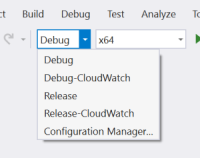  

  By default, all binaries are placed in the _**build**_ directory of the repository inside a folder corresponding to the platform and type of build (e.g. _**build\x64\Release**_).

## Getting Started
The sample is designed to run in AWS using two EC2 instances, currently **Windows only**. Refer to the CDI SDK [Windows Installation Guide](https://github.com/aws/aws-cdi-sdk/blob/mainline/INSTALL_GUIDE_WINDOWS.md) file for details on setting them up.

It is also possible to run locally with some restrictions. The complete video processing pipeline consists of a video source, an overlay source, the HTML graphics renderer, the composer, two CDI pipe component instances for both the transmitter and receiver, an encoder, and a video player. To maintain the required frame rate, the hosting machine needs to be powerful enough to handle the load, otherwise, the results may be inadequate. Of course, this consideration does not apply to EFA enabled EC2 instances which are typically much more capable machines.

> As an example, we have successfully ran the sample on an Core i7 CPU, 8 cores, and 16GB of memory with a 1280x534@24fps video source, albeit running at almost 100% CPU usage.

## Launching the Composition Pipeline
The walkthrough that follows assumes local testing with both the receiver and transmitter running in the same machine with two CDI Pipes instances configured with the `socketlibfabric` adapter to create a channel between the composer and encoder components.

To run the sample in an EFA environment instead, you will need to modify the command lines by specifying an additional **-adapter** parameter with its value set to `efa`. Also, when testing between two machines, you need to indicate a **-role** parameter, either `transmitter` or `receiver`; otherwise, the script will load all the video pipeline processes in the same machine when executed. For example:

```
EXECUTE ... -role transmitter
or
EXECUTE ... -role receiver
or the default role
EXECUTE ... [-role both]
```

Additional parameters are necessary when transmitting across the network.

On the transmitter side, the **-remote_ip** parameter specifies the IP address of the receiver. You can also provide a local IP address with the **-local_ip** parameter, although this is not required unless the machine has multiple network interfaces and you wish to select a particular one. To choose a port number different from the default value, use the **-port** parameter. For example: 

```
EXECUTE ... -role transmitter -adapter efa -remote_ip 172.27.4.60 [-local_ip 172.27.6.19] [-port 2500]
```

Unlike the transmitter, the receiver does not require a remote IP address. The same considerations mentioned for the transmitter apply to the remaining parameters.

```
EXECUTE ... -role receiver -adapter efa [-local_ip 172.27.4.60] [-port 2500]
```

> **IMPORTANT**: The firewall and the network security group must be configured to allow CDI traffic between the transmitter and receiver. Refer to the [CDI SDK](https://github.com/aws/aws-cdi-sdk/blob/mainline/README.md) documentation for additional information on how to set up and configure the EC2 instances. For this sample, traffic from the **cdipipe.exe** executable must be allowed through the firewall.

By default, both audio and video streams are transported using a single CDI connection, though other communication modes are also possible:

- `CDISTREAM` - creates a single CDI connection for both audio and video (this is the default channel mode)
- `CDI` - creates separate CDI connections for audio and video
- `TCP`- creates separate TCP connections for audio and video (for local testing only)

 The channel mode can be changed using the **-channel** parameter as shown below. For example:

```
EXECUTE ... -channel cdi
```

> **Note**: Using the CDI SDK v1.0, when starting the channel in CDI mode (i.e. separate connections), we find that the communication works reliably once a connection is established, but that it may take several attempts to successfully connect and that the initialization sometimes fails with the following assertion:  
_Assertion failed: 0 == ret, file ...\aws-cdi-sdk\src\cdi\adapter_efa.c, line 278_

Lastly, as part of the protocol, CDI can send information about the video payloads it transmits including parameters such as frame width, height and rate, sample format, bit depth, alpha channel, among other settings. Similarly, in the case of audio payloads, it can provide metadata such as channel layout, sample rate, and language. A receiver can use this information to configure itself appropriately. 

The CDI Pipe component has already been prepared to include this information along with the payload data it sends, as can be seen in the sample log output for a receiver shown below.

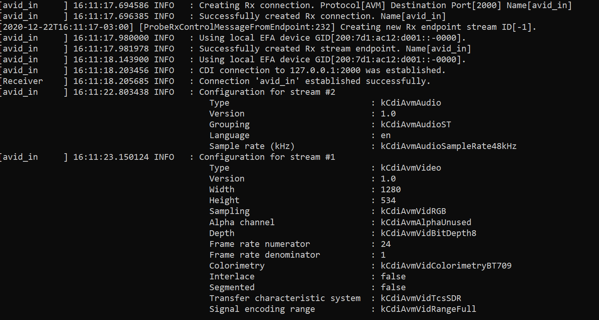

However, at this time, the receiving end of the pipeline uses FFmpeg to handle the encoding and it is started before this information is available. To overcome this limitation, when the **-role** parameter is set to `receiver`, it is necessary, at least for the time being, to provide the frame width, height and rate of the incoming video using command line parameters. For example:

```
EXECUTE ... -role receiver -width 1920 -height 1080 -framerate 30
```

### Script Usage
Running the pipeline requires starting several processes. To make this task easier, we provide a script to launch the tools for a variety of configurations. You can find the script named _**execute**_ in the _**scripts**_ folder of the repository. Refer to the [Using the Sample](#using-the-sample) section for additional details.

**EXECUTE** _\<source\>_ [_\<options...\>_]
  
    <source>                              : source file path or URL (required)

### Options:
    -role <type>                          : type of role: transmitter | receiver | both (optional, default: both)
    -mode <option>                        : receiver mode: play | stream | store (optional, default: play)
    -log_level <value>                    : log level : trace | debug | info | warning | error (optional, default: )
    -channel <type>                       : type of channel: cdi | cdistream | tcp (optional, default: cdistream)
    -width <value>                        : input source frame width (required in receiver mode, default: none)
    -height <value>                       : input source frame height (required in receiver mode, default: none)
    -framerate <value>                    : input source frame rate (required in receiver mode, default: none)
    -adapter <type>                       : type of adapter: efa | socketlibfabric
                                            (optional, default: socketlibfabric)
    -local_ip <ip_address>                : local IP address (optional, default 127.0.0.1 or IP address
                                            of first local adapter when -remote_ip is specified)
    -remote_ip <ip_address>               : remote IP address (optional, applies to transmitter only, default 127.0.0.1
                                            or IP address of first local adapter when -local_ip is specified)
    -port <port_number>                   : destination port number (optional, default 2000)
    -output <destination>                 : output file name or URL (required for stream and store receiver modes)
    -output_format <type>                 : output format type: rgb | mp4 (optional, default: mp4)

### Overlay options:
    -overlay <overlay_source>             : file path or URL of the overlay page (optional, default: no overlay)
    -overlay_window_size <width height>   : overlay window pixel width and height (optional, default: none)
    -overlay_viewport_origin <left top>   : overlay viewport origin left top coordinates (optional, default: 0 0)
    -overlay_viewport_size <width height> : overlay viewport width and height (optional, default: window size)
    -overlay_position <position>          : overlay position [top-left | top-right | bottom-left | bottom-right]
                                            (optional, default: bottom-left)
    -overlay_framerate <rate>             : overlay frame rate (optional, default: 30)
    -overlay_scale_factor <scale>         : overlay scale factor (optional, default: 1)
    -overlay_chroma_color <color>         : overlay transparent color (optional, default: none)
    -overlay_background_color <color>     : overlay background color (optional, default: none)

### Advanced options:
    -video_in_port <port_number>          : video input port number (optional, default: 1000)
    -audio_in_port <port_number>          : audio input port number (optional, default: 1001)
    -video_out_port <port_number>         : video input port number (optional, default: 3000)
    -audio_out_port <port_number>         : audio input port number (optional, default: 3001)
    -audio_stream_index <index>           : input audio stream index (optional, default: 0)
    -time_offset <seconds>                : audio/video stream time offset (optional, default: 0.9)
    -show                                 : show current settings and exit (optional, default: false)    
    -keep                                 : keep tool windows open (optional, default: false)

## Using the Sample

**IMPORTANT**: Set the following environment variables before running the _**EXECUTE**_ script or configure the required executables in the path:
- **FFMPEG_PATH**: path to _ffmpeg.exe_, _ffplay.exe_, and _ffprobe.exe_
- **TOOLS_PATH**: path to _htmlsrc.exe_ and _cdipipe.exe_
- **MEDIA_PATH**  : path to source media files

> **Note**: CloudWatch enabled configurations (**_CloudWatch-Debug_** | **_CloudWatch-Release_**) of the CDI pipe component cannot be used outside the AWS environment so you need to use either the **_Debug_** or **_Release_** build when testing locally.

For this walkthrough, download the sample video from the link below and store it in the location specified by the **MEDIA_PATH** environment variable. You can use a different video, but take into account that the machine where you are running the sample needs to be capable of handling its frame rate and frame size when running the composition process. The suggested video has a resolution of 1280 x 534 @ 24fps.

http://ftp.nluug.nl/pub/graphics/blender/demo/movies/ToS/tears_of_steel_720p.mov  

---
### Transmitting a Video using CDI
The easiest way to test the pipeline is by starting both the transmitter and receiver and playing a video. The following command launches the necessary tools in separate windows.
```
EXECUTE tears_of_steel_720p.mov
```
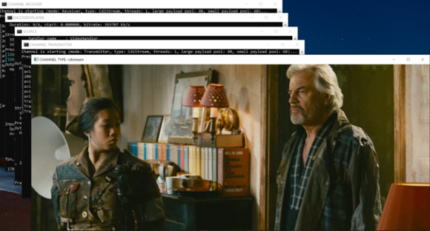

---
### Adding an Overlay
Next, you can add an overlay to the video, for example, using an HTML source loaded from a local disk file.

```
EXECUTE tears_of_steel_720p.mov -overlay "file:///overlays/rotating-sw-logo.html" -overlay_window_size 200 200 -overlay_frame_rate 24
```

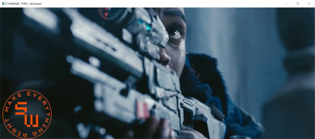

The position of the overlay can be changed using the **-overlay_position** parameter. For example:

```
EXECUTE tears_of_steel_720p.mov -overlay "file:///overlays/rotating-sw-logo.html" -overlay_window_size 200 200 -overlay_frame_rate 24 -overlay_position top-right
```

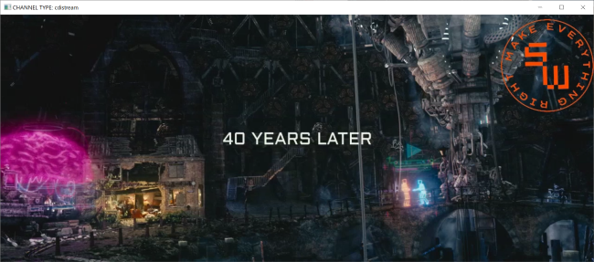

HTML overlays can also be loaded from an S3 bucket or a web page using HTTP. For example, the following command uses an animation available at https://threejs.org/examples/#webgl_morphtargets_horse. The command defines a capture region by providing a viewport origin and viewport size to exclude certain elements in the page from the overlay. It also specifies a scale factor to control the overlay size, as well as a chroma color to render the background transparently.

```
EXECUTE tears_of_steel_720p.mov -overlay https://threejs.org/examples/#webgl_morphtargets_horse -overlay_viewport_origin 500 55 -overlay_window_size 1366 768 -overlay_viewport_size 800 600 -overlay_frame_rate 24 -overlay_scale_factor 0.75 -overlay_chroma_color #F0F0F0
```
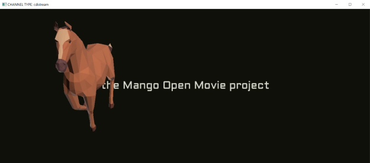

- Overlay: model by [mirada](https://mirada.com/) from [rome](http://www.ro.me/)

---
### Storing the output
So far, you have used the EXECUTE script to play back the output video. To store it to a disk file instead, specify a **-mode** parameter with a value of `store` and provide the path of the file to generate using the **-output** parameter. To stop the process and store the content received so far, press 'q' in the ENCODER window. 

```
EXECUTE tears_of_steel_720p.mov -overlay https://threejs.org/examples/#webgl_morphtargets_horse -overlay_viewport_origin 500 55 -overlay_window_size 1366 768 -overlay_viewport_size 800 600 -overlay_frame_rate 24 -overlay_scale_factor 0.75 -overlay_chroma_color #F0F0F0 -mode store -output cdi-sample.mp4
```
> **Note**: Make sure to select a new file when storing the output. If the selected file already exists, FFmpeg will prompt for confirmation before overwriting it, blocking the pipeline and causing frames to be lost. Although FFmpeg can be configured to disable this warning, we preferred to err on the side of caution and preserved this check.

As an option, the output can be stored as an uncompressed RGB stream by specifying an **-output_format** parameter with a value set to `rgb`. Note, however, that this will generate extremely large files after only few seconds. **USE WITH CAUTION**.
```
EXECUTE tears_of_steel_720p.mov -overlay https://threejs.org/examples/#webgl_morphtargets_horse -overlay_viewport_origin 500 55 -overlay_window_size 1366 768 -overlay_viewport_size 800 600 -overlay_frame_rate 24 -overlay_scale_factor 0.75 -overlay_chroma_color #F0F0F0 -mode store -output cdi-sample.rgb -output_format rgb
```
---
### HLS Streaming
In addition to the playback and storage functions, the EXECUTE script can configure the pipeline to enable streaming the composition output. To do this, set the **-mode** parameter to `stream` and the **-output** parameter  to the location where the HLS segments should be written. For example:
```
EXECUTE tears_of_steel_720p.mov -overlay https://threejs.org/examples/#webgl_morphtargets_horse -overlay_viewport_origin 500 55 -overlay_window_size 1366 768 -overlay_viewport_size 800 600 -overlay_frame_rate 24 -overlay_scale_factor 0.75 -overlay_chroma_color #F0F0F0 -mode stream -output "hls\cdi-sample.m3u8"
```

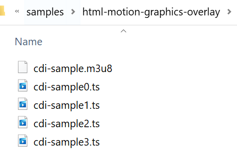


> **Note**: Make sure that the output folder exists. If you reproduce the output directly from your local disk instead of a server, be aware that the .m3u8 manifest stores segment file names in relative form and your player needs to be able to locate them. It might be necessary to change the current directory to the location of the manifest file before starting the player (e.g. `ffplay cdi-sample.m3u8`).  
When running in AWS, we have successfully used [MSP360](https://www.msp360.com/drive.aspx) to mount an S3 bucket as a local disk drive on the EC2 instance and set the output location to a local path on the mounted disk. This enabled the output to be streamed live to clients directly from the S3 bucket.

---
### Running in EC2 with EFA
So far, every command shown can be executed in a local environment provided the machine is sufficiently powerful. However, the sample is about CDI and only makes sense when running in EC2 with EFA.

When testing in AWS, all previous commands should run equally well. However, to take advantage of EFA and run the transmitter and receiver in separate machines, the command lines need to include additional parameters.

> **Note**: For the remaining description, the EC2 instance running the Composer is referred as the Transmitter and the instance running the Encoder as the Receiver.

**For the Transmitter**: specify the EFA adapter and remote IP address. Unless specified, local IP address and port will use default values.
```
EXECUTE ... -role transmitter -adapter EFA -remote_ip XX.XX.XX.XX [-local_ip YY.YY.YY.YY] [-port NNNN]
```

**For the Receiver**: specify the EFA adapter and the width, height, and frame rate of the incoming video frames. Unless specified, local IP address and port will use default values.
```
EXECUTE ... -role receiver -width WWW -height HHHH -framerate RR -adapter EFA [-local_ip YY.YY.YY.YY] [-port NNNN]
```

#### AWS Elemental MediaConnect (optional)
The scenario for the sample uses a live video source streamed from [AWS Elemental MediaConnect](https://aws.amazon.com/mediaconnect/) and requires setting up a  flow to ingest the source video and make it available to the Composer. While using a MediaConnect source is a more realistic scenario, the sample can be used without it. Instead, you can stream a video file directly to the Composer.

Follow these steps if you want to set up a MediaConnect source:
- Create a MediaConnect flow and assign it to the same VPC, security group, and subnet as your EC2 instances. For details on creating and configuring a MediaConnect flow, refer to [Getting started with AWS Elemental MediaConnect](https://docs.aws.amazon.com/mediaconnect/latest/ug/getting-started.html)
- Once your MediaConnect flow is set up, go to its **Sources** tab and make a note of the **Inbound IP address** and **Port**.

  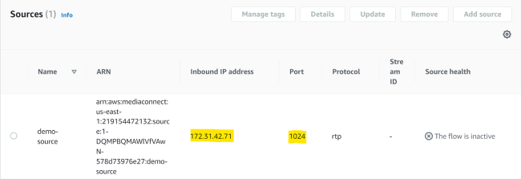

- Next, go to the **Outputs** tab and make a note of the **Destination** IP address and **Port**.

  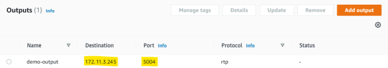

- Add an inbound rule in your EC2 instances security group allowing UDP traffic to the port configured in your MediaConnect output.

  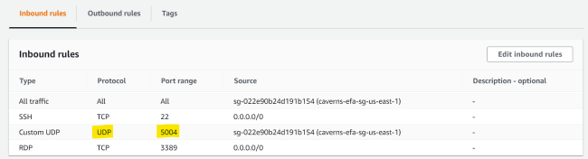

- Add an inbound rule to the Windows firewall of the Transmitter EC2 instance to allow UDP traffic to the MediaConnect port.

  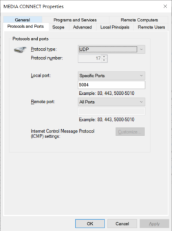

#### Preparing for HLS Streaming
Streaming requires setting an output destination for the HLS stream produced by the encoder.

For our testing, we created an [Amazon S3](https://docs.aws.amazon.com/s3/?id=docs_gateway) bucket to contain the HLS segments. Depending on your requirements, you may want to configure the bucket to manage access to its content and make it public. See [Identity and access management in Amazon S3](https://docs.aws.amazon.com/AmazonS3/latest/dev/s3-access-control.html).

Since the encoder cannot write its output directly to S3, we used a third-party product [MSP360](https://www.msp360.com/drive.aspx), formerly CloudBerry Drive, to map the S3 bucket to a local drive in the Receiver EC2 instance allowing any files written to the drive to be automatically uploaded to cloud storage.

> **Note**: It may also be possible to set the output location to an HTTP endpoint and upload the HLS segments to a web server instead (using HTTP PUT), but we have never tested this option and it might require additional configuration.

#### Starting the Encoder
Go to the Receiver EC2 instance and run the EXECUTE script with the **-mode** parameter set to `stream` and the **-output** parameter pointing to the path of the HLS manifest to generate in the mapped S3 drive. For example:

```
EXECUTE -role receiver -adapter efa -width 1280 -height 534 -framerate 24 -mode stream -output E:\cdi-demo\tears-of-steel.m3u8
```
> **Note**: Replace the **-width**, **-height**, and **-framerate** parameters with the correct settings when using a different video source. If the **-output** parameters points to a subdirectory in the mapped drive (e.g. E:\cdi-demo\tears-of-steel.m3u8), make sure that it already exists or create it before executing the command.

#### Starting the Composer
Go to the Transmitter EC2 instance and run the EXECUTE script to launch the Composer. The parameters will vary depending on whether you use a MediaConnect source or a local video file as input.

- **Using a MediaConnect source**  
  Use the following command to start the Composer with a MediaConnect source:
  ```
  EXECUTE udp://SS.SS.SS.SS:PPPP -overlay https://threejs.org/examples/#webgl_morphtargets_horse -overlay_viewport_origin 500 55 -overlay_window_size 1366 768 -overlay_viewport_size 800 600 -overlay_frame_rate 24 -overlay_scale_factor 0.75 -overlay_chroma_color #F0F0F0 -role transmitter -adapter efa -remote_ip NN.NN.NN.NN
  ```
  > **Note**: Change the source URL address `udp://SS.SS.SS.SS:PPPP` to reflect the destination IP address and port of the Media Connect flow output. Note that the scheme is `udp://` as we have experienced some issues using the expected value of `rtp://`. Replace the value of the **-remote_ip** parameter `NN.NN.NN.NN` with the IP address of the Receiver instance 

- **Using a Local source**  
  A simpler scenario that does not require setting up MediaConnect is also possible. Copy the source video to the EC2 instance running the Composer and use the following commmand to stream it directly to the Composer. 

  ```
  EXECUTE tears_of_steel_720p.mov -overlay https://threejs.org/examples/#webgl_morphtargets_horse -overlay_viewport_origin 500 55 -overlay_window_size 1366 768 -overlay_viewport_size 800 600 -overlay_frame_rate 24 -overlay_scale_factor 0.75 -overlay_chroma_color #F0F0F0 -role transmitter -adapter efa -remote_ip NN.NN.NN.NN
  ```
  > **Note**: Replace the value of the **-remote_ip** parameter `NN.NN.NN.NN` with the IP address of the Receiver instance 

### Starting the Video Source
When using a local video source, no additional steps are necessary as the Composer has direct access to the video and starts transmitting it as soon as it starts.
  
When using a MediaConnect source, start the flow and the live source. If you do not have a live source, you can replace it with a video file streaming in an endless loop using the following command.

```
EXECUTE tears_of_steel_720p.mov -role source -output rtp://XX.XX.XX.XX:NNNN
```
> **Note**: replace the IP address and port with the inbound IP address and port of the MediaConnect flow in the command above.

### Streaming the Composition Output
Wait a few seconds for the process to start. You should see a message in both the channel transmitter and channel receiver consoles indicating that the CDI connection was established. Soon after, the encoder window will start to log a message as each segment is generated. You should see the HLS segments stored in the mapped S3 drive using File Explorer.

Similarly, the [Amazon S3 console](https://s3.console.aws.amazon.com/) will show the uploaded HLS content.

  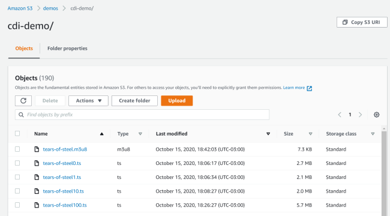

You can use any player capable of playing an HLS stream to see the composition output being generated live, provided you have configured the bucket permissions correctly. For example:
```
ffplay https://demos.s3.amazonaws.com/demos/cdi-demo/tears-of-steel.m3u8
```
  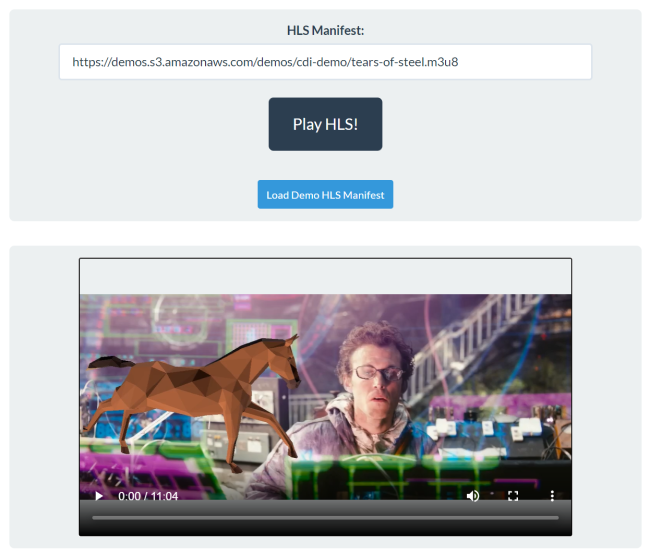

## Known Issues
- Pressing 'q' does not exit the composer when adding an overlay. Press CTRL + C instead.
- Pressing 'q' does not exit the encoder in 'play' mode. Press CTRL + C instead.
- Some baseline configuration settings are hard-coded.
- It may take several attempts to successfully connect when configuring the CDI pipe channel in CDI mode (i.e. separate connections) using CDI SDK v1.0. The connection initialization may fail with the following assertion:  
_Assertion failed: 0 == ret, file ...\aws-cdi-sdk\src\cdi\adapter_efa.c, line 278_    
- Audio and video may start to be out of sync when the CPU cannot handle the load.